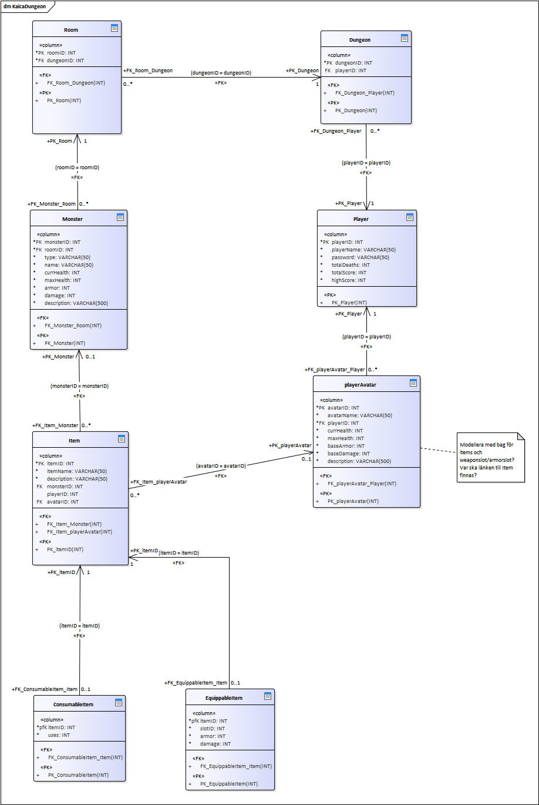
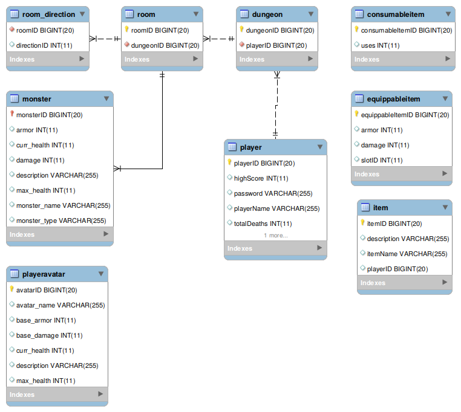

# Assignment III - KaicaDungeon
This is a dungeon adventure game for the java VM. It uses Java Persistance API via Hibernate. Current build engine is Gradle and with mavenCentral repositories for dependency sourcing.


## Joblist & QnA
todo: What is @ManyToOne(fetch = FetchType.LAZY)?
todo: Discriminator column and uniqe ID column for Avatar?
todo: Standardise id fields where `this.id` applies to all Entities and `entityId` is the FK column name if
    referencing the PK, or simply `entity` if field variable is holding `entity` instance.
todo: Decide upon Entities holding instances of FK referenced Entities or EntityID's.


todo: put a global annotations file package-info.java file in a sensible place (maybe `/src/main/resources`) and make sure that it is read by Hibernate.
    This file will make it possible to have globally accessible special queries etc.
    This file is also the location for the enhanced sequence strategy defenition.


Q: How do transactions work in Hibernate. Does a call to Session.save() execute a query directly or will they be batched for execution only after a Transaction.commit() call?

Q: Hiberante requirement of a protected default no-arguments constructor. (Can it be public)?
    // todo: Is for example not Room's constructor supposed to be protected according to Hibernate's standards?


Q: How to reduce log4j2 debug output from specific modules/imports
A:<Logger name="org.hibernate.orm.connections.pooling" level="info"/> specify the package and change the level. 

Q: Where to store the hibernate.cfg.xml file. Different places mean different things. https://stackoverflow.com/questions/35725306/org-hibernate-internal-util-config-configurationexception-could-not-locate-cfg#35725560
A: Not a great deal of difference. Classroot is easiest.

Q: What is the difference between the XML (hibernate.cfg.xml or persistance.xml) file using persistence-unit tags or sessionFactory tags?
A: This is part of the difference between JPA and Hibernate.


# Documentation
This application uses a persistance system based on the JPA specifications called Hibernate.


### Setup for development - manual
These steps are one way of getting the repository ready for development.

1) git clone the repository

2) Use gradle to fetch the dependencies into the local project folder. The gradle task for copying the dependencies is `cpDeps`. The task is run: `./gradlew cpDeps` results dependencies available for development in lib/ folder. IDE loading will more efficiently keep local copies of repositories to be available for multiple projects.

3) Configure your IDE to load dependencies *.jar files from `lib` is done by `file->Project Structure->Libraries->[plus-sign]` and then adding the directory `lib`. Consider deleting all other references to other libraries/locations for the project (if there are any).

4) Modify the src/resources/hibernate.cfg.xml to use mariaDB or mySQL and set your credentials and url parameters.

To build and run the project with gradle using the gradle wrapper `./gradlew build` and then `./gradlew run` to run the application.

### Setup for development - automatic with IJ idea
This is probably the usual method for work on this project

1) git clone the repository

2) Open the project in IJ idea.

3) Stand by while dependencies are satisfied. These will not be stored in the project folder usually, but are instead downloaded to gradle cache for access by all java projects.

4) Modify the src/resources/hibernate.cfg.xml to use mariaDB or mySQL db, and to set your credentials, utl, port etc.

Building and running will likely be within the realms of the IDE in these instances.


# Structure and design

### Dependencies
* hibernate-core
* mysql-connector-java
* log4j2

### UML diagram
This is the logical model for the the application object oriented design (not necessarily 100% up to date).


### Logical Database Design
The primary keys of tables are created by the database server. This means that the annotation `@GeneratedValue(strategy = GenerationType.IDENTITY)` is used. There are significant drawback to this method as it can be substantially slower due to Hibernate not knowing which is the next PK value before the INSERT is made.

#### Entities mappings
```xml
<mapping class="kaica_dun.entities.Avatar"/>
<mapping class="kaica_dun.entities.Direction"/>
<mapping class="kaica_dun.entities.Dungeon"/>
<mapping class="kaica_dun.entities.Fighter"/>
<mapping class="kaica_dun.entities.Item"/>
<mapping class="kaica_dun.entities.ItemConsumable"/>
<mapping class="kaica_dun.entities.ItemEquippable"/>
<mapping class="kaica_dun.entities.Monster"/>
<mapping class="kaica_dun.entities.Room"/>

<mapping class="kaica_dun_system.User"/>
```
        
#### Logical Diagram
This is a diagram of the logical database model (not necessarily 100% up to date) resulting from forward engineering database tables using Hibernate and JPA.
Other aspects to the projects logical design are the method for autoincrementing the Primary Key values wich in this case follows the SEQUENCE method where Java will dictate the sequencing.  [Auto-incrementing and Java Persistence API](https://thoughts-on-java.org/jpa-generate-primary-keys/)



###
### Application logging
Log can be written to stdout, but also to file `log/app.log`. Settings concerning application logging are specified in `resources/log4j2.xml`.


### Project directory structure
The [directory structure](https://maven.apache.org/guides/introduction/introduction-to-the-standard-directory-layout.html) for tthis project follows the default structure of Maven and Gradle.

### Style guide
This project attempts to adhere to the following [style guide](https://github.com/weleoka/myJavaStyleGuide).  
An exception to the style guide is made with the constant LOGGER wich is allowed to be lowercase.

# End, links, notes etc.
*Log4j 2*
log4j 2 with hibernate. log4j v1.2 is the better candidate, but I think the problems have been resolved.
https://logging.apache.org/log4j/2.x/manual/configuration.html
https://howtodoinjava.com/log4j2/
https://stackify.com/java-logging-best-practices/
https://thoughts-on-java.org/hibernate-logging-guide/

