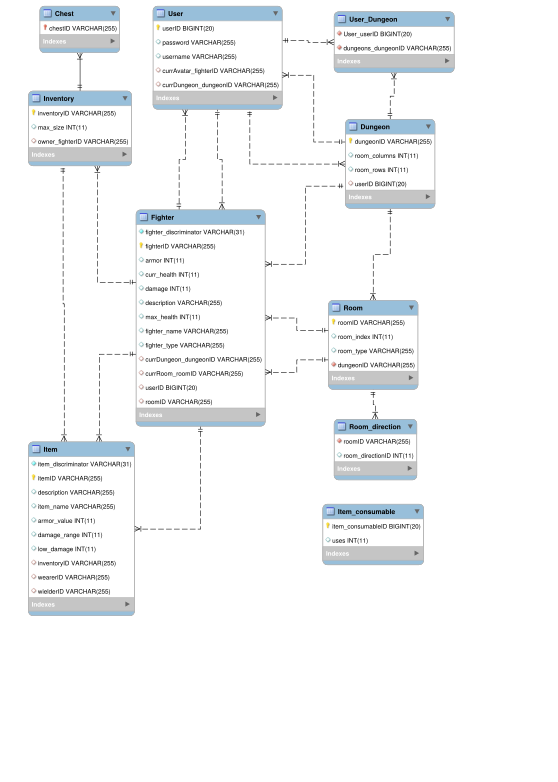

# Kaica Dungeon - adventure game [](https://opensource.org/licenses/mit-license.php)
This is a dungeon adventure game for the java VM. It uses Java Persistance API via Hibernate. Current build engine is Gradle and with mavenCentral repositories for dependency sourcing.

## Repository information
The repository, as of from initial release v0.1.0 (which is a development release), follows a standard workflow structure, sometimes called the Git Feature Branch Workflow. A description of such a workflow is described at [Nvie Git Branches](https://nvie.com/posts/a-successful-git-branching-model/). To introduce the structure it contains the following branches and their roles.  
There are two main branches: `master` and `develop`. HEAD in `master` is a production ready state. This means that it should be ready to compile and run. HEAD in `develop` is the latest incorporated features and bugfix branches and should be in a state ready to run in development mode. When `develop` is in a stable state it can be merged into `master`. Usually there will be some configuration changes in order to make the `master` branch production ready. Details in `CHANGELOG.md` should be checked, and other standard procedures followed. Conclude the work with a commit, and a version bump. The versioning is according to [Semantic Versioning](https://semver.org/spec/v2.0.0.html). On the issue of then merging this state of `master` to what is known as a release branch; that is not enforced in this repository. For historical releases simply checkout earlier commits in `master`.  
There is a naming strategy of branches from `develop`. Branches from develop can be features or bugfixes. The naming convention is as follows: `[ft/fix]-{2-3 word summary}-{id_sequence}` example: `ft-23-save-game`. The id_sequence is to maintain a clear list of sequences of branches from `develop`.  
There is only one other type of branch that may be used and that is the hotfix type, naming: `[hotfix]-{2-3 word summary}-{hotfix_id_sequence}`. Hotfix is used if a severe bug is found in production, in which case a branch can be made from `master` where the bug is addressed and then merged back into `master`. Important to remember is to then merge the hotfix into `develop` when at a suitable stage in that branch.

# Documentation
This application uses a persistence system based on the JPA specifications called Hibernate. It also uses a transaction management implementation included in the Spring framework. To compile the program as a standalone application see instructions in documentation.

## Main components
Main types naming: service, menu (translatable to management), data access objects, configuration, entities, factories and miscellaneous interfaces.
The service classes have the following responsibilities, as well as for certain processes.

GameService - Avatars & Dungeons  
MovementService - Avatars & Rooms  
CombatService - Avatars & Monsters  
ActionEngineService - Monsters & Directions  
UserService - Users and the authentication  


## Setup 
The following sections cover a few different scenarios relevant for this project. Steps for setup for development, and development with IDE, build with gradle, and finally also compilation for different persistence providers.

### Development - manual
These steps are one way of getting the repository ready for development.

1. git clone the repository
2. Use gradle to fetch the dependencies into the local project folder. The gradle task for copying the dependencies is `cpDeps`, and the downloaded total for the dependencies is 27MB. The task `cpDeps` makes dependencies available for development by placing them in `lib/` folder. This is not always required as in most instances IDE loading will more efficiently keep local copies of repositories available, and with the added benefit of providing availability for multiple projects.
3. Make your IDE load dependencies *.jar files from `lib` in your project structure settings in the IDE. Consider removing other references to libraries/locations if there are any.
4. Rename `src/resources/application_example.properties` to `src/resources/application.properties` and edit it to use mariaDB, mySQL or hsqldb, and maybe set your credentials and url parameters. Or if required use a standalone environment by setting up file-based hsqldb as per instructions for "Production build with hsqldb".


To build and run the project with gradle wrapper `./gradlew build`, and then `./gradlew run` to run the application.

If `./gradlew run` does not work then try the `./gradlew installDist` or `./gradlew distZip` and run the resulting file in the `/bin` folder.


### Development - automatic (for IJ idea)
This is probably the usual method for work on this project

1. git clone the repository
2. Open the project in IJ idea.
3. Stand by while dependencies are satisfied. These will not be stored in the project folder usually, but are instead downloaded to gradle cache for access by all java projects.
4. Rename `src/resources/application_example.properties` to `src/resources/application.properties` and edit it to use mariaDB or mySQL db, and to set your credentials, url, port etc.

Building and running will likely be within the realms of the IDE in these instances.


### Production build with hsqldb
As always there are few tweaks to be done before compiling successfully for production.

For HSQLDB - standalone game:

1. Optional: switch out the primary DataSource bean's configuration by changing the prefix `datasource.sqldb` to `datasource.hsqldb` in `config/DataSourceCfg.java`
2. If you don't have it already rename `src/resources/application_example.properties` to `src/resources/application.properties` and edit it to use mariaDB, mySQL or hsqldb, and maybe set your credentials and url parameters.
3. Set the kaica.debug parameter to false
4. Change the dialect in `application.config` to the HSQL dialect by switching the commenting out.
5. Optional: change the ddl mode in `application.config` from create-drop to update, but only after ensuring that the tables are in existence. This is a question of weather or not you want save game functions.
6. Change the debug in `cfg/KaicaDunCfg.java` from true to false. 
7. Finally set the logging level to warn for all the loggers in `log4j2.xml` and consider changing the appender to file out so you can monitor log/app.log for issues. 

Now it is possible to run the builds using gradle wrapper: `./gradlew distZip` or `gradlew.bat distZip` in windows should yield results.

### Production build with maria/mySql db
Currently not covered in the documentation.


## Dependencies and outline
The following is a selection of details on dependencies and general structure. The information here will probably be less to date than the repository. 

### Dependencies
* hibernate-core
* mysql-connector-java
* mariadb-java-client
* log4j2
* Spring boot 5.2
* HSQLDB for file based relational db.
* Spring orm, context, core, boot-starter-log4j, starter-data-jpa
* hsqldb for standalone application


## Logical Database Design
The primary keys of tables are unique ids in the format `ebbed36f-95a1-404a-9a10-4d531703c510`, as well as Integer Long auto-incrementing.

### UML diagram of application
This is the logical model for the the application object oriented design, again this is probably not up to date.


### Entities mappings
```xml
<mapping class="kaica_dun_system.User"/>

<mapping class="kaica_dun.entities.Dungeon"/>
<mapping class="kaica_dun.entities.Room"/>
<mapping class="kaica_dun.entities.Direction"/>
<mapping class="kaica_dun.entities.ItemConsumable"/>
<mapping class="kaica_dun.entities.Item"/>
<mapping class="kaica_dun.entities.Armor"/>
<mapping class="kaica_dun.entities.Weapon"/>
<mapping class="kaica_dun.entities.Fighter"/>
<mapping class="kaica_dun.entities.Avatar"/>
<mapping class="kaica_dun.entities.Monster"/>
<mapping class="kaica_dun.entities.Inventory"/>
```
        
### Logical Diagram of relational database
This is a diagram of the logical database model (not necessarily 100% up to date) resulting from forward engineering database tables using Hibernate and JPA, and MySQL Workbench.



## Misc

### Application logging
Log can be written to stdout, but also to file, default `log/app.log`. Settings concerning application logging are specified in `resources/log4j2.xml`.


### Project directory structure
The [directory structure](https://maven.apache.org/guides/introduction/introduction-to-the-standard-directory-layout.html) for this project follows the default structure of Maven and Gradle.


### Style guide
This project attempts to adhere to the following [style guide](https://github.com/weleoka/myJavaStyleGuide).  


# Meta
Developers:  
Carn Granström - email: *removed*  
Kai Weeks - email: *removed*  

Distributed under the MIT license. See [LICENSE.md](https://github.com/weleoka/kaica_dun/LICENCE.md) for more information.


# Contributing
Generally contributing is not going to be met with any particular enthusiasm, as this project is purely educational. If you think it could be fun to get involved then follow the next steps, or ask advice of the core developers directly.

1. Fork it (https://github.com/weleoka/kaica_dun/fork)
2. Create your feature branch (git checkout -b feature/fooBar)
3. Commit your changes (git commit -am 'Add some fooBar')
4. Push to the branch (git push origin feature/fooBar)
5. Create a new Pull Request
