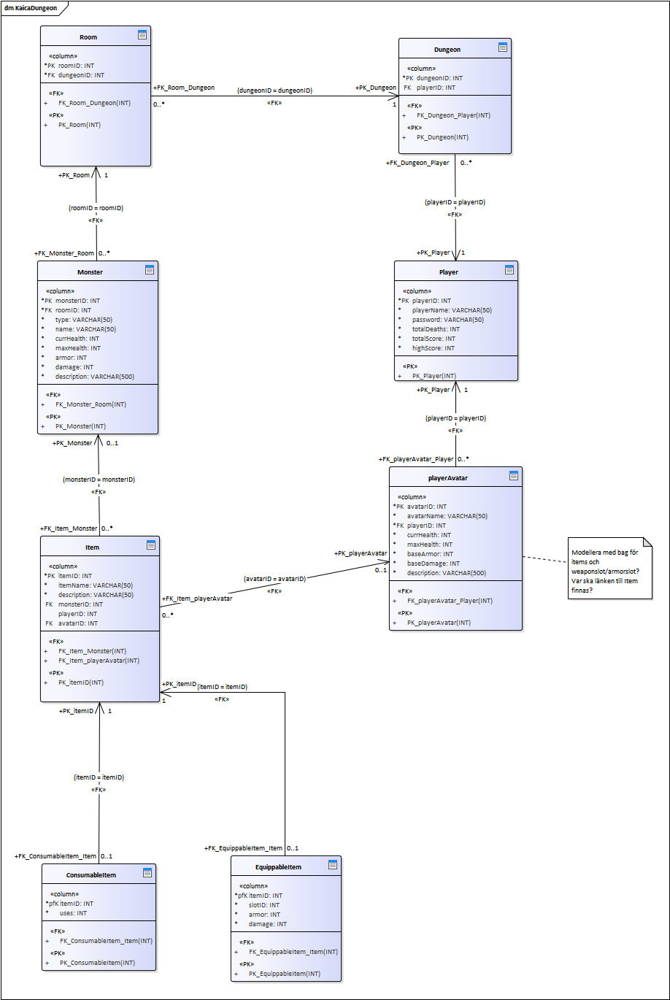

# Assignment III - KaicaDungeon
This is a dungeon adventure game for the java VM. It uses Java Persistance API via Hibernate. Current build engine is Gradle and with mavenCentral repositories for dependency sourcing.

## Last completed steps
(empty)

### Joblist & Questions

todo: Make sure that we are happy with package, its naming and structure.

Q: Where to store the hibernate.cfg.xml file. Different places mean different things. https://stackoverflow.com/questions/35725306/org-hibernate-internal-util-config-configurationexception-could-not-locate-cfg#35725560

todo: Put forth that contributors work with parameters in terms of: db, db user, password, port, and schema(DDL).

todo: Initialise log4j properly http://logging.apache.org/log4j/1.2/faq.html#noconfig 

#### Setup for development - manual

1) git clone the repository

2) Use gradle to fetch the dependencies into the local project folder. The gradle task for copying the dependencies is `cpDeps`. The task is run: `./gradlew cpDeps` results dependencies available for development in lib/ folder. IDE loading will more efficiently keep local copies of repositories to be available for multiple projects.

3) Configure your IDE to load dependencies *.jar files from `lib` is done by `file->Project Structure->Libraries->[plus-sign]` and then adding the directory `lib`. Consider deleting all other references to other libraries/locations for the project (if there are any).

To build and run the project with gradle using the gradle wrapper `./gradlew build` and then `./gradlew run` to run the application.

#### Setup for development - automatic with IJ idea
This is probably the usual method for work on this project

1) git clone the repository

2) Open the project in IJ idea.

3) Stand by while dependencies are satisfied. These will not be stored in the project folder usually, but are instead downloaded to gradle cache for access by all java projects.

Building and running will likely be within the realms of the IDE in these instances.

#### Dependencies
* hibernate-core
* mysql-connector-java
* log4j

### UML diagram
This is the logical model for the database and object persistance.

### Project directory structure
The [directory structure](https://maven.apache.org/guides/introduction/introduction-to-the-standard-directory-layout.html) for tthis project follows the default structure of Maven and Gradle.

### Style guide
This project attempts to adhere to the following [style guide](https://github.com/weleoka/myJavaStyleGuide).

